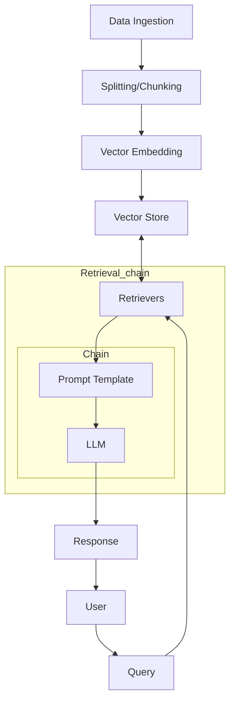

Retrieval Augmented Generation Application

```mermaid
flowchart TD
    A[Data Ingestion] --> B[Splitting/Chunking]

    B --> C[Vector Embedding]

    C --> D[Vector Store]

    D <--> E[Retrievers] 

    subgraph Retrieval_chain
    E --> F[Prompt Template]

    subgraph Chain
    F --> G[LLM]
    end
    end
    
    H[Query] --> E

    I[User] --> H

    G --> Response --> I[User]
```
