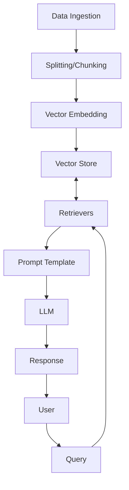

Retrieval Augmented Generation Application

```mermaid
flowchart TD
    A[Data Ingestion] --> B[Splitting/Chunking]

    B --> C[Vector Embedding]

    C --> D[Vector Store]

    D <--> E[Retrievers] 

    E --> F[Prompt Template]

    F --> G[LLM]

    H[Query] --> E

    I[User] --> H

    G --> Response--> I[User]
```
